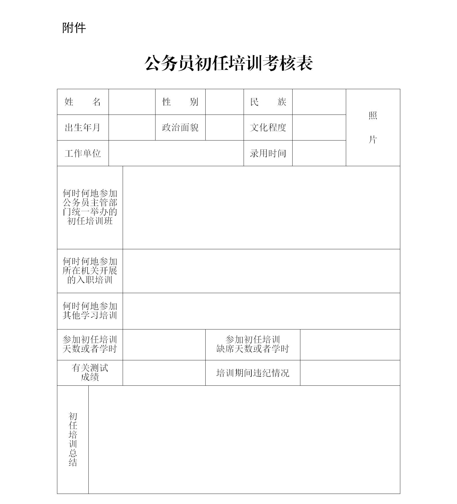
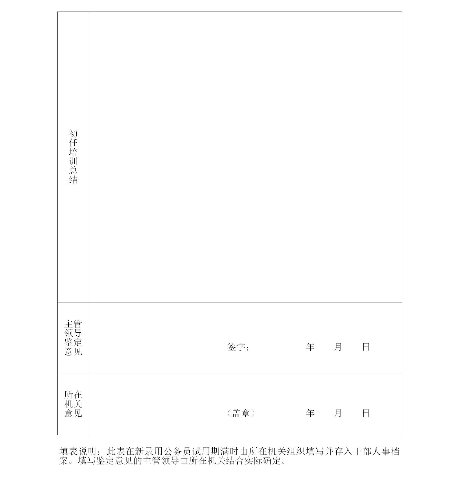

## 公务员初任培训办法（试行）

> （2021年8月25日中共中央组织部制定 2021年9月17日发布）

- **第一条**　　为提高公务员初任培训工作科学化、制度化、规范化水平，加强源头培养和战略培养，建设信念坚定、为民服务、勤政务实、敢于担当、清正廉洁的高素质专业化公务员队伍，根据《中华人民共和国公务员法》和《干部教育培训工作条例》、《公务员培训规定》等有关法律法规，制定本办法。

- **第二条**　　本办法适用于对新录用公务员进行的初任培训。

  初任培训一般由市（地）级以上公务员主管部门统一组织。新录用公务员所在机关应当严格落实初任培训任务，做到应训尽训。专业性较强、新录用公务员较多的机关，经同级公务员主管部门同意，可按照统一要求自行组织初任培训，培训情况应当及时报送同级公务员主管部门。垂直管理部门、双重管理单位的公务员初任培训按照有关规定组织实施。

- **第三条**　　初任培训必须坚持以马克思列宁主义、毛泽东思想、邓小平理论、“三个代表”重要思想、科学发展观、习近平新时代中国特色社会主义思想为指导，突出政治标准和政治训练，重点提高新录用公务员思想政治素质和依法依规、按程序办事等适应机关工作的能力，教育引导新录用公务员增强“四个意识”、坚定“四个自信”、做到“两个维护”，牢记初心使命，加强党性修养、筑牢信仰之基，加强政德修养、打牢从政之基，严守纪律规矩、夯实廉政之基，健全基本知识体系、强化能力之基，走好公务员职业生涯第一步。

- **第四条**　　初任培训应当把习近平新时代中国特色社会主义思想作为主课、必修课，重点加强党的理论和路线方针政策，党中央重大决策部署，政治机关意识，理想信念宗旨，党史、新中国史、改革开放史、社会主义发展史，国家治理体系和治理能力现代化，宪法和法律，党章党规党纪和党风廉政建设，中国特色公务员制度，机关工作理念方法，国家安全和保密知识等培训。

  各地区各部门应当结合实际完善公务员初任培训内容。

- **第五条**　　初任培训一般采取集中脱产培训的方式，主要采取公务员主管部门统一举办初任培训班和公务员所在机关结合实际开展入职培训的形式进行。根据需要可以采取线上培训和线下培训相结合等方式进行。

  初任培训应当在试用期内完成，时间一般不少于12天或者90学时。

- **第六条**　　公务员主管部门统一举办的初任培训班举行开班式，一般按照以下程序进行：

  - （一）集体宪法宣誓。宣誓场所、宣誓仪式和宣誓誓词参照国家工作人员宪法宣誓有关规定执行。监誓人一般由公务员主管部门负责同志担任。

  - （二）优秀公务员作事迹报告或者经验介绍。

  - （三）公务员主管部门负责同志作开班动员。

- **第七条**　　新录用公务员所在机关开展的入职培训是公务员初任培训的重要组成部分，应当按照新录用公务员类别、岗位和所在机关层级完善培训内容，重点加强习近平总书记有关重要论述和重要指示批示精神，所在机关职能职责和历史沿革、相关政策法规、业务知识技能、应急管理、办文办会办事程序、规章制度、优良传统作风，公务员职业道德，心理健康知识等培训。

  入职培训可采取脱产培训、岗位实习等方式进行，根据需要可组织开展军训。新录用公务员较少的机关，可按照性质类似或者业务相近原则，与有关机关联合开展入职培训。县、乡机关新录用公务员的入职培训，可由县级公务员主管部门结合实际组织实施。

- **第八条**　　公务员主管部门、新录用公务员所在机关对初任培训应当坚持从严管理，严肃培训纪律，切实改进学风。

  有关培训机构应当严格教师和学员管理，加强授课内容审查把关，确保授课内容政治立场、政治方向正确；落实中央组织部印发的《干部教育培训学员管理规定》，执行学员考勤等制度。授课教师必须对党忠诚、政治坚定，严守纪律、严谨治学，不得传播违反党的理论和路线方针政策、违反中央决定的错误观点。学员应当端正学习态度，认真参加培训，严格遵守学习培训、安全保密和廉洁自律各项规定。

- **第九条**　　新录用公务员所在机关或者有关培训机构应当采取开展培训内容测试、审核学员培训总结等形式，综合考虑学员考勤和遵守纪律情况，对学员参加初任培训的表现和成效进行考核评价。

  公务员主管部门统一举办的初任培训班结束后，学员表现情况、考核评价结果由有关培训机构及时反馈学员所在机关。新录用公务员参加初任培训的情况作为试用期满考核的内容。没有参加初任培训或者初任培训考核不合格的新录用公务员，不能任职定级。

  完善初任培训登记制度，新录用公务员试用期满时由所在机关组织填写《公务员初任培训考核表》（见附件）并存入干部人事档案。

- **第十条**　　公务员主管部门统一举办的初任培训班一般委托党校（行政学院）、干部学院、社会主义学院等组织实施，统筹用好干部党性教育基地、党员教育基地、公务员实践教育基地、廉政教育基地、爱国主义教育基地等优质培训资源。

  各级公务员主管部门、新录用公务员所在机关和有关培训机构应当采取措施提高初任培训师资水平，组织政策理论水平高、机关工作经验丰富的领导干部、公务员先进典型和业务骨干上讲台；完善初任培训课程体系，组织开发培训课程，及时更新课程内容；组织学好用好公务员初任培训全国统编教材。中央和国家机关各部门、省级公务员主管部门可根据需要，组织编写体现本行业本系统本地区特点的培训资料。

  公务员初任培训所需经费按规定列入财政预算。各地区各部门组织人事部门应当结合实际编制公务员初任培训经费预算，严格落实培训经费管理有关规定。

- **第十一条**　　有关培训机构组织开展初任培训质量评估，评估结果及时反馈公务员主管部门。

  公务员主管部门适时采取召开座谈会、问卷调查、实地走访或者第三方评估等形式，对新录用公务员素质能力、履职情况进行跟踪评估，评估结果作为改进完善初任培训工作的重要依据。

- **第十二条**　　参照公务员法管理的机关（单位）中除工勤人员以外的工作人员的初任培训，参照本办法执行。

- **第十三条**　　本办法由中共中央组织部负责解释。

- **第十四条**　　本办法自发布之日起施行。

---

### 附件

  

  

  [[点击下载表格]](images/crpx.zip)
