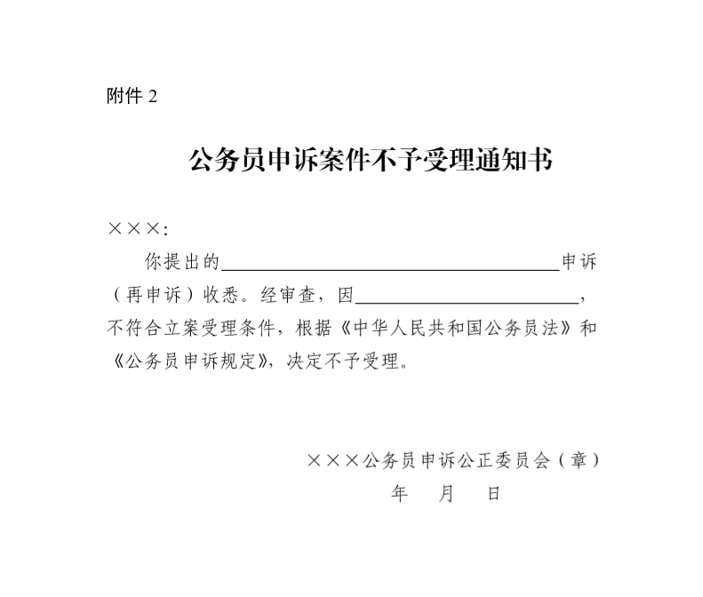

## 公务员申诉规定

> （2008年5月14日中共中央组织部、人力资源社会保障部制定并发布 2022年3月1日中共中央组织部部务会会议修订 2022年3月19日中共中央组织部发布）

### 第一章　总则

- **第一条**　　为了依法处理公务员申诉，保障公务员合法权益，建设信念坚定、为民服务、勤政务实、敢于担当、清正廉洁的高素质专业化公务员队伍，根据《中华人民共和国公务员法》等有关法律法规，制定本规定。

- **第二条**　　公务员对涉及本人的人事处理不服，可以依照本规定申请复核或者提出申诉。

  法律法规对监察官、法官、检察官的申诉另有规定的，从其规定。

  领导成员公务员的申诉，按照有关规定办理。

- **第三条**　　公务员申诉工作坚持以马克思列宁主义、毛泽东思想、邓小平理论、“三个代表”重要思想、科学发展观、习近平新时代中国特色社会主义思想为指导，贯彻落实新时代党的组织路线和干部工作方针政策，完善机关内部监督机制，促进机关依法行使职权，规范公务员依法维权，坚持下列原则：

  - （一）依法依规、有错必纠；

  - （二）公平公正、处理恰当；

  - （三）稳慎及时、注重沟通。

- **第四条**　　复核、申诉期间，人事处理继续执行。

  公务员不因申请复核或者提出申诉而被加重处理。

### 第二章　机构与管辖

- **第五条**　　受理公务员申诉的机关应当组成公务员申诉公正委员会，负责对案件事实、适用法律法规、工作程序等进行审议，向受理机关提出审理意见。

  公务员申诉公正委员会实行一案一委员会制，一般由受理机关的人员组成，可以吸收其他机关的有关人员参加。公务员申诉公正委员会组成人数为单数，设主任委员一名，负责案件审理的组织工作。

- **第六条**　　公务员对本人所在机关作出的人事处理不服的申诉，由同级公务员主管部门管辖。

  省级以下机关公务员对公务员主管部门作出的申诉处理决定不服的再申诉，由同级党委或者上一级公务员主管部门管辖。其中，对省、自治区、直辖市公务员主管部门作出的申诉处理决定不服的再申诉，由省、自治区、直辖市党委管辖。地方党委受理的再申诉，由党委指定的部门负责组建公务员申诉公正委员会开展案件审理工作。

- **第七条**　　县级以下机关公务员对经县级党委批准或者乡镇党委作出的人事处理不服的申诉，由上一级公务员主管部门管辖。

- **第八条**　　中央垂直管理部门省级以下机关公务员对人事处理不服的申诉，由上一级机关管辖。对申诉处理决定不服的再申诉，由作出申诉处理决定的机关的上一级机关管辖。

- **第九条**　　实行双重领导并以上级单位领导为主的部门省级以下机关、省以下垂直管理部门公务员申诉的管辖，参照本规定第八条的规定执行。对省垂直管理机关作出的申诉处理决定不服的再申诉，由省、自治区、直辖市党委管辖。

- **第十条**　　公务员对监察机关作出的涉及本人的处理决定不服的，向监察机关申请复审、复核。

### 第三章　申请与受理

- **第十一条**　　公务员对涉及本人的下列人事处理不服，可以申请复核或者提出申诉：

  - （一）处分；

  - （二）辞退或者取消录用；

  - （三）降职；

  - （四）定期考核定为不称职；

  - （五）免职；

  - （六）申请辞职、提前退休未予批准；

  - （七）不按照规定确定或者扣减工资、福利、保险待遇；

  - （八）法律、法规规定可以申诉的其他情形。

- **第十二条**　　公务员申请复核，应当自知道该人事处理之日起30日内向原人事处理机关提交书面申请。在复核决定作出前，申请复核的公务员不得提出申诉。复核决定逾期未作出的，申请复核的公务员可以在复核期满之日起15日内提出申诉。

- **第十三条**　　公务员对复核结果不服的，可以自接到复核决定之日起15日内提出申诉；也可以不经复核，自知道人事处理之日起30日内直接提出申诉。

  公务员对申诉处理决定不服的，可以自接到申诉处理决定之日起30日内提出再申诉。

- **第十四条**　　公务员提出申诉和再申诉，应当提交申诉书等材料，提出再申诉的，还应当提交申诉处理决定复印件。

  申诉书应当载明下列内容：

  - （一）申诉人的姓名、单位、职务职级、联系方式、住址及其他基本情况；

  - （二）被申诉机关的名称及作出的人事处理决定和复核的情况；

  - （三）申诉的事项、理由及要求；

  - （四）提出申诉的日期。

- **第十五条**　　因不可抗力等正当理由超过规定的期限申请复核或者提出申诉、再申诉的，经受理机关批准可以提出申请。

- **第十六条**　　复核、申诉、再申诉应当由受到人事处理的公务员本人提出；如本人丧失行为能力或者死亡，可以由其配偶、父母、子女、兄弟姐妹等近亲属代为提出。

- **第十七条**　　受理机关应当对申请人提出的申诉、再申诉是否符合受理条件进行审查，在接到申诉书之日起30日内，作出受理或者不予受理的决定，并以书面形式通知申请人。不予受理的，应当说明理由。

- **第十八条**　　符合以下条件的申诉、再申诉，应予受理：

  - （一）申请人符合本规定第十六条的规定；

  - （二）申诉、再申诉事项属于本规定第十一条规定的受理范围；

  - （三）在规定的期限内提出；

  - （四）属于受理机关管辖；

  - （五）申诉材料齐备。

  凡不符合上述条件之一的申诉、再申诉，不予受理。

  申诉材料不齐备的，应当及时一次性告知申请人，限期15日内补正。审查期限自收到全部补正材料后的次日起算。

- **第十九条**　　对于决定受理的申诉案件，受理机关自决定受理之日起7日内向被申诉机关送达应诉通知书和申诉书副本。

  被申诉机关接到应诉通知书之日起15日内提交答辩书，并提供作出该人事处理决定的依据和证据。

  受理机关收到答辩书后，经审核符合答辩要求的，在7日内将副本送达申诉人，申诉人在接到答辩书副本7日内可以提出书面意见。

- **第二十条**　　处理决定作出前，申请人可以书面提出撤回复核、申诉和再申诉的申请。受理机关在接到申请后终结处理工作，并书面告知申请人和被申诉机关。

  申请人撤回复核、申诉和再申诉后，如无正当理由，不得再以同一事由提出。

### 第四章　审理与决定

- **第二十一条**　　原人事处理机关在接到复核申请书后，应当对人事处理认定的事实、依据和工作程序等进行全面核查，在30日内作出维持、撤销或者变更原人事处理的复核决定，并书面通知申请人。

- **第二十二条**　　受理申诉和再申诉的机关应当自决定受理之日起60日内作出处理决定。案情复杂的，可以适当延长，但是延长时间不得超过30日。

- **第二十三条**　　受理机关对公务员申诉、再申诉涉及事项，应当调查核实。调查应当由2名以上工作人员进行。接受调查的机关和个人应当如实提供情况。

  调查人员应当充分听取申诉人、被申诉机关和相关人员的意见，加强沟通协调，做好政策解释和矛盾调处工作。

- **第二十四条**　　受理机关应当将申诉案件材料和调查材料提交公务员申诉公正委员会进行全面审阅。必要时，公务员申诉公正委员会可以听取申诉人和被申诉机关当面陈述申辩。

- **第二十五条**　　公务员申诉公正委员会根据调查情况对下列事项进行审议：

  - （一）原人事处理认定的事实是否存在、清楚，证据是否确凿、充分；

  - （二）原人事处理适用法律、法规、规章和有关规定是否正确；

  - （三）原人事处理的程序是否符合规定；

  - （四）原人事处理是否显失公正；

  - （五）被申诉机关有无超越职权或者滥用职权的情形；

  - （六）其他需要审议的事项。

  在审理对复核决定、申诉处理决定不服的申诉、再申诉时，还应当对复核决定和申诉处理决定进行审议。

- **第二十六条**　　公务员申诉公正委员会应当按照少数服从多数的原则提出明确审理意见，并向受理机关提交审理报告。审议中的不同意见应当如实记入审理报告。

- **第二十七条**　　对于事实清楚、规定明确的申诉案件，调查、审理程序可以适当简化。

- **第二十八条**　　受理机关应当根据公务员申诉公正委员会的审理意见，区别不同情况，作出下列申诉处理决定：

  - （一）原人事处理认定事实清楚，适用法律、法规、规章和有关规定正确，处理恰当、程序合法的，维持原人事处理。

  - （二）原人事处理认定事实不存在的，按照管理权限责令原人事处理机关撤销或者直接撤销原人事处理。

  - （三）原人事处理认定事实清楚，但适用法律、法规、规章和有关规定有误，或者处理明显不当的，按照管理权限责令原人事处理机关变更或者直接变更原人事处理。

  - （四）原人事处理认定事实不清，证据不足，或者违反规定程序和权限的，责令原人事处理机关重新处理。

  再申诉处理决定应当参照前款规定作出。

  受理机关在作出申诉处理决定的同时，可以就申诉案件向原人事处理机关提出人事管理有关意见。

- **第二十九条**　　申诉处理决定作出后，要制作申诉处理决定书。申诉处理决定书应当载明下列内容：

  - （一）申诉人的姓名、单位、职务职级及其他基本情况；

  - （二）被申诉机关的名称，原人事处理和复核决定所认定的事实、理由及适用的法律、法规、规章和有关规定；

  - （三）申诉的事项、理由及要求；

  - （四）公务员申诉公正委员会认定的事实、理由及适用的法律、法规、规章和有关规定；

  - （五）申诉处理决定；

  - （六）作出决定的日期；

  - （七）其他需要载明的内容。

  再申诉处理决定书除前款规定内容外，还应当载明申诉处理决定的内容和作出申诉处理决定的日期。

  申诉处理决定书和再申诉处理决定书应当加盖受理机关或者公务员申诉公正委员会的印章。

- **第三十条**　　申诉处理决定书应当在作出处理决定之日起7日内送达申诉人和原人事处理机关。再申诉处理决定书还应当送达作出申诉处理决定的机关。

- **第三十一条**　　原人事处理机关应当将复核决定书、申诉处理决定书、再申诉处理决定书存入受处理公务员个人档案。

  申诉处理机关应当自作出处理决定之日起60日内，将申诉案件处理和执行等情况按照管理权限向上一级公务员主管部门或者上一级机关备案。

- **第三十二条**　　公务员申诉公正委员会委员和受理机关工作人员与案件当事人存在利害关系、可能影响案件公正处理的，本人应当自行回避。申诉人和被申诉机关也可以申请相关人员回避，受理机关在收到回避申请之日起3个工作日内作出决定。回避决定作出前，相关人员暂停参与调查和审理。

- **第三十三条**　　案件审理期间，因不可抗力等原因导致无法审理的，受理机关可以决定中止审理工作，待有关情形消除后，再恢复审理工作。

- **第三十四条**　　公务员申诉公正委员会委员和受理机关工作人员，对工作中涉及的国家秘密、工作秘密、商业秘密和个人隐私应当保密。

### 第五章　执行与监督

- **第三十五条**　　申诉处理决定在发生效力后执行。

  下列处理决定是发生效力的决定：

  - （一）已过法定期限没有提出再申诉的申诉处理决定；

  - （二）中央公务员主管部门作出的申诉处理决定；

  - （三）中央垂直管理机关作出的申诉处理决定；

  - （四）再申诉处理决定。

- **第三十六条**　　原人事处理机关在申诉处理决定生效后30日内执行，并将执行情况书面告知作出申诉处理决定的机关。

- **第三十七条**　　非因违反规定程序和权限，被责令重新处理的，原人事处理机关不得以同一事实和理由作出与原处理决定相同或者基本相同的处理决定。

  公务员对重新作出的人事处理决定不服，可以提出申诉、再申诉。

- **第三十八条**　　原人事处理错误的，应当及时予以纠正；造成名誉损害的，应当赔礼道歉、恢复名誉、消除影响；造成经济损失的，依法给予赔偿，并视情况对作出错误处理的责任人进行处理。

- **第三十九条**　　机关不执行发生效力的申诉处理决定，或者对申诉人打击报复的，对负有责任的领导人员和直接责任人员，受理申诉的机关可以向有关机关提出给予其处理处分的建议；构成犯罪的，依法追究刑事责任。

- **第四十条**　　公务员在复核、申诉中捏造事实，诬告、陷害他人的，根据情节轻重，给予批评教育或者处分；给他人造成名誉损害的，应当赔礼道歉、恢复名誉、消除影响；构成犯罪的，依法追究刑事责任。

- **第四十一条**　　公务员申诉公正委员会委员和受理机关工作人员，不按本规定处理公务员复核、申诉的，根据情节轻重，给予批评教育或者处分；构成犯罪的，依法追究刑事责任。

### 第六章　附则

- **第四十二条**　　参照公务员法管理的机关（单位）中除工勤人员以外的工作人员的申诉，参照本规定执行。

- **第四十三条**　　本规定由中共中央组织部负责解释。

- **第四十四条**　　本规定自发布之日起施行。

附件：

  1．公务员申诉案件受理通知书

  2．公务员申诉案件不予受理通知书

  3．公务员申诉案件应诉通知书

---

### 附件：

  

  

  

  [[点击下载表格]](images/gwyss.zip)
