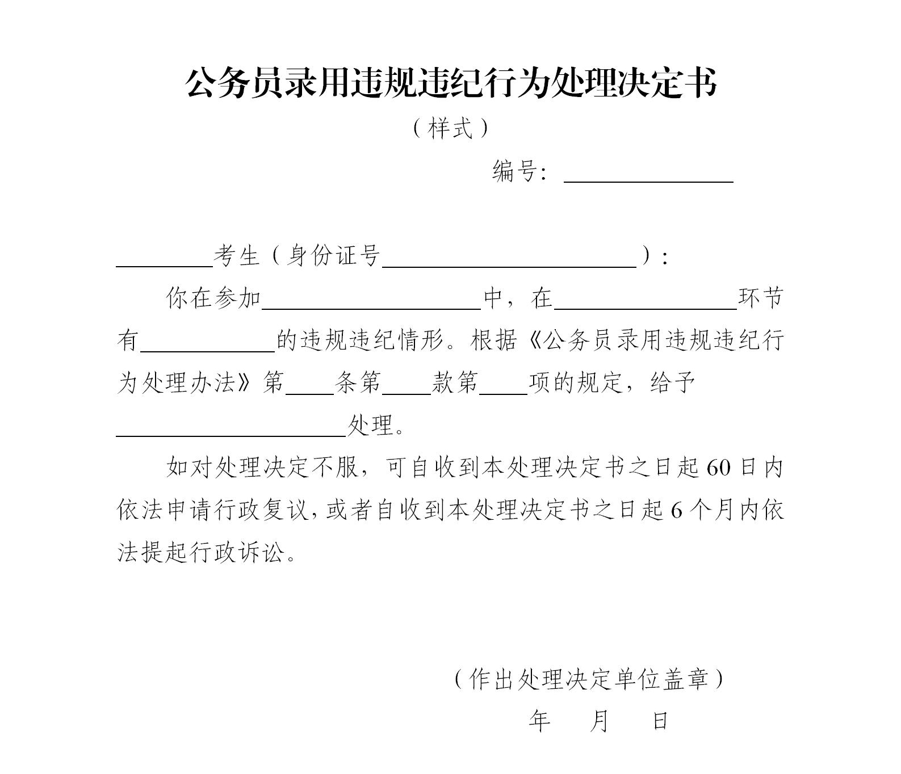

## 公务员录用违规违纪行为处理办法

> （2009年11月9日中共中央组织部、人力资源社会保障部制定 2016年9月6日中共中央组织部、人力资源社会保障部、国家公务员局修订 2021年8月25日中共中央组织部部务会会议修订 2021年9月18日中共中央组织部、人力资源社会保障部发布）

### 第一章　总则

- **第一条**　　为规范公务员录用违规违纪行为的认定与处理，维护公务员录用工作的公平公正，严把公务员队伍入口关，根据《中华人民共和国公务员法》和《公务员录用规定》等有关法律法规，制定本办法。

- **第二条**　　本办法适用于公务员录用中报考者和工作人员违规违纪行为的认定与处理。

- **第三条**　　公务员录用违规违纪行为的认定与处理，应当事实清楚、证据确凿、程序规范、适用规定准确。

- **第四条**　　公务员主管部门、招录机关和考试机构以及其他相关单位按照规定的职责权限，对违规违纪行为进行认定与处理。

### 第二章　报考者违规违纪行为处理

- **第五条**　　报考者提交的涉及报考资格的申请材料或者信息不实的，负责资格审查工作的招录机关或者公务员主管部门应当认定其报名无效，终止其录用程序；有恶意注册报名信息，扰乱报名秩序或者伪造、变造有关材料骗取报考资格等行为的，由设区的市级以上公务员主管部门给予其取消本次报考资格并五年内限制报考公务员的处理。

- **第六条**　　报考者在考试过程中有下列行为之一的，由具体组织实施考试的考试机构、招录机关或者公务员主管部门给予其所涉科目（场次）考试成绩为零分的处理：

  - （一）将规定以外的物品带入考场，经提醒仍未按要求放在指定位置的；

  - （二）参加考试时未按规定时间入场、离场的；

  - （三）未在指定座位参加考试，或者擅自离开座位、出入考场的；

  - （四）未按规定填写（填涂）、录入本人或者考试相关信息，以及在规定以外的位置标注本人信息或者其他特殊标记的；

  - （五）故意损坏本人试卷、答题卡（答题纸）等考场配发材料或者本人使用的考试机等设施设备的；

  - （六）在考试开始信号发出前答题的，或者在考试结束信号发出后继续答题的；

  - （七）其他情节较轻的违规违纪行为。

- **第七条**　　报考者在考试过程中有下列行为之一的，由设区的市级以上公务员主管部门给予其取消本次考试资格并五年内限制报考公务员的处理：

  - （一）抄袭他人答题信息或者协助他人抄袭答题信息的；

  - （二）查看、偷听违规带入考场与考试有关的文字、视听资料的；

  - （三）使用禁止携带的通讯设备或者具有计算、存储功能电子设备的；

  - （四）携带具有避开或者突破考场防范作弊的安全管理措施，获取、记录、传递、接收、存储考试试题、答案等功能的程序、工具，以及专门用于作弊的程序、工具（以下简称作弊器材）的；

  - （五）抢夺、故意损坏他人试卷、答题卡（答题纸）、草稿纸等考场配发材料或者他人使用的考试机等设施设备的；

  - （六）违反规定将试卷、答题卡（答题纸）等考场配发材料带出考场的；

  - （七）其他情节严重、影响恶劣的违规违纪行为。

- **第八条**　　报考者在考试过程中有下列行为之一的，由省级以上公务员主管部门给予其取消本次考试资格并终身限制报考公务员的处理：

  - （一）使用伪造、变造或者盗用他人的居民身份证、准考证以及其他证明材料参加考试的；

  - （二）3人以上串通作弊或者参与有组织作弊的；

  - （三）代替他人或者让他人代替自己参加考试的；

  - （四）使用本办法第七条第四项所列作弊器材的；

  - （五）非法侵入考试信息系统或者非法获取、删除、修改、增加系统数据的；

  - （六）其他情节特别严重、影响特别恶劣的违规违纪行为。

- **第九条**　　在阅卷过程中发现报考者之间同一科目作答内容雷同，并经阅卷专家组确认的，由具体组织实施考试的考试机构给予其该科目（场次）考试成绩为零分的处理，录用程序终止。作答内容雷同的认定方法和标准由省级以上考试机构确定。

  报考者之间同一科目作答内容雷同，并有其他相关证据证明其作弊行为成立的，视具体情形按照本办法第七条、第八条的规定处理。

- **第十条**　　报考者有隐瞒影响录用的疾病或者病史以及其他妨碍体检工作正常进行的行为，情节较轻的，负责组织体检的招录机关或者公务员主管部门应当终止其录用程序；有交换、替换检验样本等情节严重、影响恶劣行为的，由设区的市级以上公务员主管部门给予其取消本次考试资格并五年内限制报考公务员的处理；有串通作弊、让他人顶替体检等情节特别严重、影响特别恶劣行为的，由省级以上公务员主管部门给予其取消本次考试资格并终身限制报考公务员的处理。

- **第十一条**　　报考者在考察、体能测评、心理素质测评等环节有弄虚作假、隐瞒事实真相以及其他妨碍相关工作正常进行的行为，情节较轻的，负责组织实施的招录机关或者公务员主管部门应当终止其录用程序；情节严重、影响恶劣的，由设区的市级以上公务员主管部门给予其取消本次考试资格并五年内限制报考公务员的处理；情节特别严重、影响特别恶劣的，由省级以上公务员主管部门给予其取消本次考试资格并终身限制报考公务员的处理。

- **第十二条**　　报考者应当自觉维护公务员录用工作秩序，有下列行为之一的，应当终止其录用程序；情节严重、影响恶劣的，由设区的市级以上公务员主管部门给予其取消本次考试资格并五年内限制报考公务员的处理；情节特别严重、影响特别恶劣的，由省级以上公务员主管部门给予其取消本次考试资格并终身限制报考公务员的处理：

  - （一）故意扰乱考点、考场等工作场所秩序的；

  - （二）拒绝、妨碍工作人员履行管理职责的；

  - （三）威胁、侮辱、诽谤、诬陷、殴打工作人员或者其他报考者的；

  - （四）通过搞利益输送或者利益交换，谋取考试资格、录用机会、经济利益以及其他不当利益的；

  - （五）购买本办法第七条第四项所列作弊器材的；

  - （六）其他扰乱公务员录用工作秩序的行为。

- **第十三条**　　报考者在公务员录用中有违规违纪行为，涉嫌违法犯罪的，移送有关国家机关依法处理。

  报考者为国家公职人员的，应当将其违规违纪行为和处理结果通报所在单位。

- **第十四条**　　试用期间查明报考者有本办法所列违规违纪行为的，应当取消录用并按照本办法的有关规定给予其相应的处理。

  任职定级后查明有本办法所列违规违纪行为的，按照有关规定给予其相应的处理。

- **第十五条**　　报考者有情节严重、影响恶劣或者情节特别严重、影响特别恶劣的违规违纪行为的，应当记入公务员录用诚信档案库，并按照有关规定进行信用信息共享等管理。

### 第三章　工作人员违规违纪行为处理

- **第十六条**　　有下列情形之一的，根据情节轻重，依规依纪依法追究负有责任的领导人员和直接责任人员责任；涉嫌违法犯罪的，移送有关国家机关依法处理：

  - （一）不按照规定的编制限额和职位要求进行录用的；

  - （二）不按照规定的任职资格条件和程序录用的；

  - （三）未经授权，擅自出台、变更录用政策，造成不良影响的；

  - （四）录用工作中徇私舞弊的；

  - （五）发生泄露试题、违反考场纪律以及其他影响公平、公正行为的。

- **第十七条**　　工作人员有下列情形之一的，根据情节轻重，依规依纪依法追究责任；涉嫌违法犯罪的，移送有关国家机关依法处理：

  - （一）泄露试题和其他录用秘密信息的；

  - （二）利用工作便利，伪造考试成绩或者其他录用工作有关资料的；

  - （三）利用工作便利，协助报考者作弊的；

  - （四）因工作失职，影响录用工作正常进行的；

  - （五）其他违反录用工作纪律的行为。

### 第四章　违规违纪行为处理程序

- **第十八条**　　报考者的违规违纪行为被当场发现的，工作人员应当予以制止，并收集、保存相应证据材料，如实记录违规违纪事实和现场处置情况，由2名以上工作人员签字，报送负责组织有关工作的公务员主管部门、招录机关或者考试机构。

- **第十九条**　　对报考者违规违纪行为作出处理决定前，应当告知报考者拟作出的处理决定以及相关事实、理由和依据，并告知报考者依法享有陈述和申辩的权利。作出处理决定的公务员主管部门、招录机关或者考试机构对报考者提出的事实、理由和证据，应当进行复核。

- **第二十条**　　对报考者违规违纪行为作出处理决定的，应当制作公务员录用违规违纪行为处理决定书，采取直接送达、委托送达、邮寄送达或者公告等方式送达。

  对给予五年内限制报考公务员或者终身限制报考公务员处理的报考者，限制报考的日期自作出处理决定之日起计算。

- **第二十一条**　　报考者对违规违纪行为处理决定不服的，可以依法申请行政复议或者提起行政诉讼。

- **第二十二条**　　对工作人员违规违纪行为的处理，由相关单位按照职责权限和程序办理。

  工作人员对违规违纪行为处理不服的，可以按照规定申请复核或者提出申诉等。

### 第五章　附则

- **第二十三条**　　报考者和工作人员以外的其他人员，有干扰公务员录用秩序等行为的，依据有关法律法规处理。

- **第二十四条**　　参照公务员法管理的机关（单位）中除工勤人员以外的工作人员录用中违规违纪行为的认定与处理，参照本办法执行。

- **第二十五条**　　本办法由中共中央组织部、人力资源社会保障部负责解释。

- **第二十六条**　　本办法自发布之日起施行。

### 附件：公务员录用违规违纪行为处理决定书（样式）

```plaintext
　　　　　　　　　　　　公务员录用违规违纪行为处理决定书
　　　　　　　　　　　　　　　　　　（样式）

　　　　　　　　　　　　　　　　　　　　　　　　　　　　　　　　　　　编号：＿＿＿＿＿＿＿

　　考生（身份证号＿＿＿＿＿＿＿＿＿＿＿）：

　　你在参加＿＿＿＿＿＿＿＿＿中，在＿＿＿＿＿＿＿＿环节有＿＿＿＿＿＿的违规违纪情形。
根据《公务员录用违规违纪行为处理办法》第＿＿＿＿条第＿＿＿＿款第＿＿＿＿项的规定，给予
＿＿＿＿＿＿＿＿＿＿处理。

　　如对处理决定不服，可自收到本处理决定书之日起60日内依法申请行政复议，或者自收到本处理
决定书之日起6个月内依法提起行政诉讼。

　　　　　　　　　　　　　　　　　　　　　　　　　　　　　　　　　（作出处理决定单位盖章）

　　　　　　　　　　　　　　　　　　　　　　　　　　　　　　　　　　　　　年　月　日
```


[点击下载](../images/wjcl.zip)
