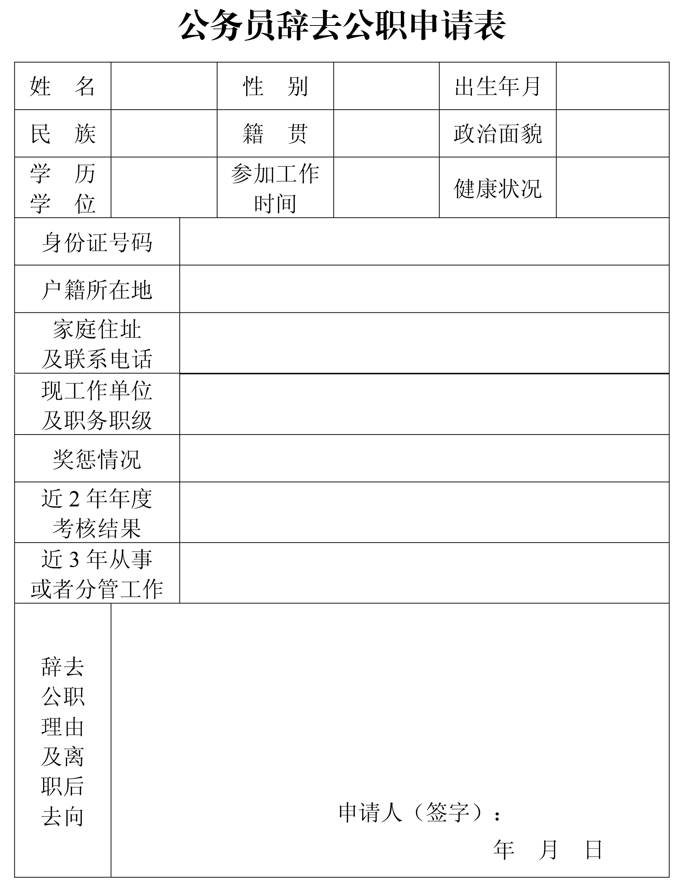
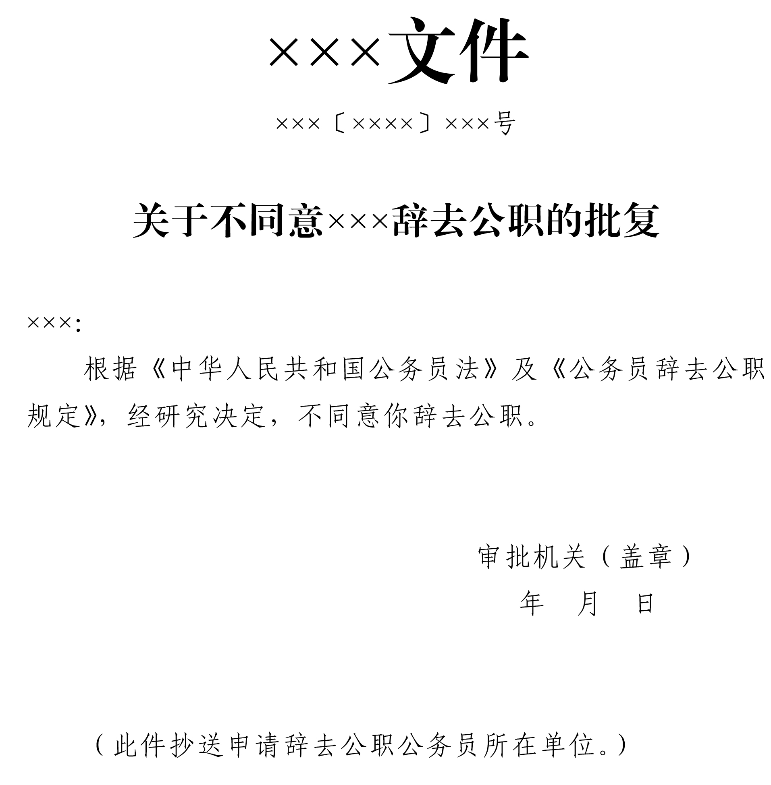

## 公务员辞去公职规定

> （2009年7月9日中共中央组织部部务会会议审议批准 2009年7月24日中共中央组织部、人力资源社会保障部发布 2020年12月8日中共中央组织部部务会会议修订 2020年12月28日中共中央组织部发布）

### 第一章　总则

- **第一条**　　为了规范公务员辞去公职工作，保障机关和公务员的合法权益，建设信念坚定、为民服务、勤政务实、敢于担当、清正廉洁的高素质专业化公务员队伍，根据《中华人民共和国公务员法》等有关法律法规，制定本规定。

- **第二条**　　公务员辞去公职，是指公务员依照法律法规规定，申请终止与任免机关的任用关系。

  法律法规对公务员中领导成员以及监察官、法官、检察官等辞去公职另有规定的，按照有关规定办理。

- **第三条**　　公务员辞去公职工作坚持以马克思列宁主义、毛泽东思想、邓小平理论、“三个代表”重要思想、科学发展观、习近平新时代中国特色社会主义思想为指导，贯彻新时代党的组织路线和干部工作方针政策，加强党对公务员队伍的集中统一领导，坚持下列原则：

  - （一）党管干部；

  - （二）尊重个人意愿和从严审核审批相结合；

  - （三）保障合法流动和加强离职后从业管理相结合；

  - （四）依法依规办事。

- **第四条**　　各级公务员主管部门按照管理权限和职责分工负责公务员辞去公职工作的综合管理、业务指导和监督检查。各级机关按照管理权限负责公务员辞去公职的审核、审批、从业限制期限内从业情况的了解核查等工作。

### 第二章　辞去公职情形和程序

- **第五条**　　公务员辞去公职，应当依照法定的情形、权限和程序办理。

- **第六条**　　公务员有下列情形之一的，不得批准辞去公职：

  - （一）未满国家规定的最低服务年限的；

  - （二）在涉及国家秘密等特殊职位任职或者离开上述职位不满国家规定的脱密期限的；

  - （三）正在接受审计，或者重要公务尚未处理完毕且须由本人继续处理的；

  - （四）正在接受纪律审查、监察调查，或者涉嫌犯罪，司法程序尚未终结的；

  - （五）法律、行政法规规定的其他不得辞去公职的情形。

- **第七条**　　公务员辞去公职，按照下列程序办理：

  - （一）本人向任免机关提出书面申请，填写《公务员辞去公职申请表》。担任县处级副职以上领导职务或者二级调研员及相当层次以上职级的，应当一并报告个人有关事项。

  - （二）组织人事部门审核，重点审核公务员是否具有不得辞去公职或者辞去公职后的从业限制情形，并征求其所在单位和纪检监察机关、保密等部门的意见。同时，提醒其严格遵守从业限制规定，告知违规从业须承担的法律责任。

  - （三）任免机关审批，作出同意或者不同意辞去公职的批复。同意辞去公职的，应当同时免去其所任领导职务、职级。其中，对需要进行经济责任审计的，应当事先按照有关规定进行审计。

  - （四）任免机关将批复送公务员所在单位和申请辞去公职的公务员。

  - （五）同意辞去公职的，办理公务交接手续。

  - （六）将同意辞去公职的批复和《公务员辞去公职申请表》等存入本人人事档案，同时将批复送同级公务员主管部门备案。

- **第八条**　　任免机关应当自接到公务员辞去公职申请之日起30日内予以审批，其中，对领导成员辞去公职的申请，应当自接到申请之日起90日内予以审批。

- **第九条**　　经批准辞去公职的公务员办理公务交接手续，应当自批准之日起10个工作日内完成。

  对拒不办理公务交接手续的，撤销同意辞去公职的决定，给予开除处分。

- **第十条**　　公务员申请辞去公职未予批准的，可以按照规定申请复核或者提出申诉。复核、申诉期间不停止该人事处理决定的执行。

- **第十一条**　　公务员在辞去公职审批期间不得擅自离职。对擅自离职的，给予开除处分。

- **第十二条**　　公务员与所在机关因专项培训等订立协议约定工作期限的，在未满约定工作期限内一般不得申请辞去公职。申请辞去公职的，应当向所在机关支付违约金或者履行相应义务。

  机关要求申请辞去公职公务员支付的违约金数额不得超过约定工作期限尚未履行部分所应分摊的培训费用，最高数额不得超过机关提供的专项培训费用。

### 第三章　管理与纪律

- **第十三条**　　公务员辞去公职后，不再具有公务员身份，自批准之日的次月起停发工资，社会保险按照有关规定执行。

- **第十四条**　　公务员辞去公职后，原所在机关应当自批准之日起2个月内将其人事档案转递至相应的人事档案工作机构、公共就业和人才服务机构或者本人户籍所在地社会保障服务机构。具体按照人事档案工作有关规定办理。

  本人应当配合转递人事档案，未予配合的，其后果由本人承担。

- **第十五条**　　公务员辞去公职后重新就业的，在计算工作年限时，其辞去公职前在机关的工作年限合并计算。

- **第十六条**　　公务员辞去公职的，原系领导成员、县处级以上领导职务的公务员在离职3年内，不得接受原任职务管辖地区和业务范围内的企业、中介机构或者其他营利性组织的聘用，不得从事与原任职务管辖业务直接相关的营利性活动；其他公务员在离职2年内，不得接受与原工作业务直接相关的企业、中介机构或者其他营利性组织的聘用，不得从事与原工作业务直接相关的营利性活动。

  前款所称原任职务，是指公务员辞去公职前3年内担任过的领导职务；原工作业务，是指公务员辞去公职前3年内从事过的工作业务。

- **第十七条**　　公务员辞去公职后，在从业限制期限内，应当于每年年底前向原所在机关报告从业情况。原所在机关应当同时对其从业情况进行了解和核实，对是否违反从业限制规定作出认定。

  省级以上具有行业监管、行政许可、行政处罚、司法等职能的机关，应当结合实际建立公务员辞去公职后从业行为限制清单，并报同级公务员主管部门备案。

- **第十八条**　　公务员辞去公职后有违反本规定第十六条规定行为的，原所在机关应当及时告知同级公务员主管部门。公务员主管部门会同其原所在机关责令限期解除与接收单位的聘用关系或者终止违规经营活动；逾期不改正的，按照公务员法第一百零七条规定，由县级以上市场监管部门没收该人员从业期间的违法所得，责令接收单位将该人员予以清退，并根据情节轻重，对接收单位处以被处罚人员违法所得1倍以上5倍以下的罚款。

- **第十九条**　　在公务员辞去公职工作中，对有不按照规定的条件和程序审核、审批以及从业限制管理等情形的，予以责令纠正；根据情节轻重，依规依纪依法追究负有责任的领导人员和直接责任人员责任。

### 第四章　附则

- **第二十条**　　参照公务员法管理的机关（单位）中除工勤人员以外的工作人员辞去公职，参照本规定执行。

- **第二十一条**　　本规定由中共中央组织部负责解释。

- **第二十二条**　　本规定自发布之日起施行。

附件：

  1.公务员辞去公职申请表

  2．关于同意×××辞去公职的批复

  3．关于不同意×××辞去公职的批复

---

### 附件：

#### 附件1

  

  

  [[点击下载表格]](../images/gwycqgzsqb.zip)

#### 附件2

  

  [点击下载](../images/tycqgzpf.zip)

#### 附件3

  

  [点击下载](../images/btycqgzpf.zip)
