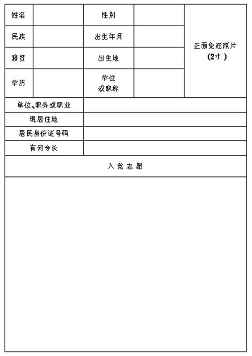
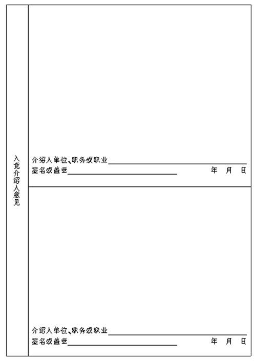
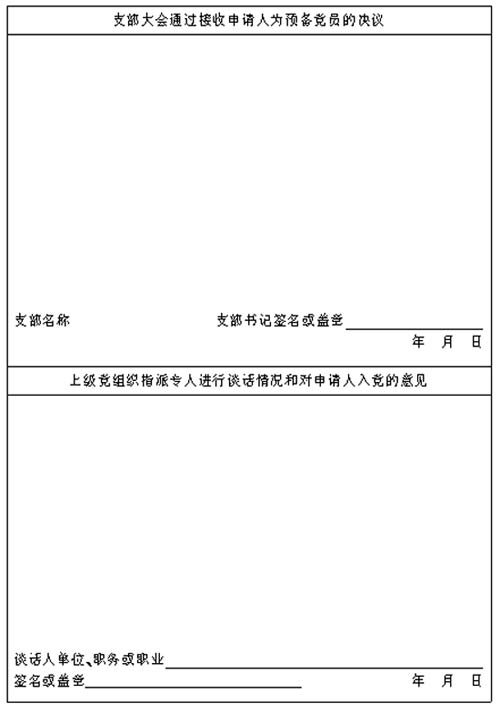
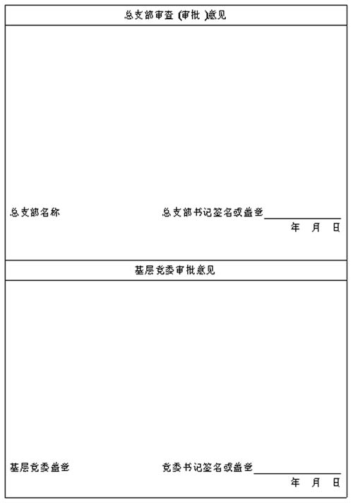
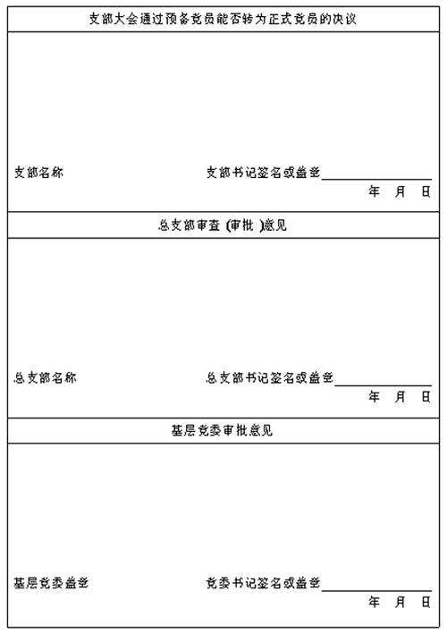
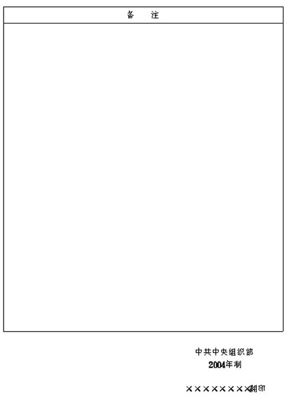

## 中共中央组织部关于印制、使用《中国共产党入党志愿书》（2004年制）的通知

> （2004年6月19日）

按照党的十六大提出的发展党员工作的新要求，根据发展党员工作实际，我们对1983年印制的《中国共产党入党志愿书》进行了修订。现将《中国共产党入党志愿书》（2004年制）式样和印制说明印发给你们，请按要求印制。

中共中央组织部决定，《中国共产党入党志愿书》（2004年制）自2004年10月1日起使用，1983年制的《中国共产党入党志愿书》同时停止使用。

附件：

1. 《中国共产党入党志愿书》（2004年制）式样；

2. 《中国共产党入党志愿书》（2004年制）印制说明；

3. 《中国共产党入党志愿书》（2004年制）填写说明。

---

## 中国共产党入党志愿书

```plaintext
　　　　　　　　　　　　　　　　申请人姓名＿＿＿＿＿
```

**说　明**

**一**、申请人填写入党志愿书要严肃、认真、忠实。填写前，党支部负责人或入党介绍人应将表内项目向申请人解释清楚。

**二**、填写入党志愿书须使用钢笔、签字笔或毛笔，并使用黑色或蓝黑色墨水。字迹要清晰、工整。表内的年、月、日一律用公历和阿拉伯数字。表内栏目没有内容填写时，应注明“无”。个别栏目填写不下时，可加附页。

**三**、在上级党组织批准预备党员转为正式党员后，应及时将入党志愿书存入本人档案，没有档案的，由基层党委保存。

```plaintext
　　　　　　　　　　　　　　　　誓　词

　　我志愿加入中国共产党，拥护党的纲领，遵守党的章程，履行党员义务，执行党的决定，严守党的纪律，保守党的秘密，对党忠诚，积极工作，为共产主义奋斗终身，随时准备为党和人民牺牲一切，永不叛党。
```














---

## 《中国共产党入党志愿书》（2004年制）印制说明

《中国共产党入党志愿书》（2004年制）由各省、自治区、直辖市党委组织部，中央直属机关工委、中央国家机关工委组织部，国资委党委、各金融机构党委组织部，铁道部政治部，解放军总政治部组织部，香港工委、澳门工委组织部按照中央组织部提供的电子版统一印制。印制规格如下：

1. 以16开（260mm×184mm）白色80克胶板纸双面印制，中缝装订。

2. 封面党徽套红印制，规格为32mm×32mm.

  “中国共产党”为一号华文中宋体，“入党志愿书”为小初号加粗华文中宋体。

  “申请人姓名”为小二号宋体。

3. 封二“说明”标题为小一号华文中宋体，正文为小三号仿宋体。

4. “誓词”标题为一号华文中宋体，正文为二号楷体。

5. 第1页“正面免冠照片（2寸）”为小四号仿宋体，“入党志愿”为二号楷体，其余为四号仿宋体。

6. 第4页“本人经历（包括学历）”为小三号加粗楷体，其余为小四号仿宋体。

7. 第5—8页各栏文字均为四号仿宋体。

8. 第9—13页每栏标题均为小三号加粗楷体，其余为四号仿宋体。

9. 封底“中共中央组织部”“2004年制”为三号黑体。翻印单位在落款下方标注“××××××××翻印”字样，为三号仿宋体。

10. 表格外框为207mm×139mm。外框与纸张边缘上、下、左、右的边距分别为25mm、28mm、24mm、21mm。表内所有字体位置、行高、列宽、所留空白，均应与式样一致。

---

## 《中国共产党入党志愿书》（2004年制）填写说明

1. “姓名”应与居民身份证一致。

2. “民族”填写全称。

3. “籍贯”填写本人的祖居地（指祖父的长期居住地）。“籍贯”和“出生地”按现行政区划填写到县（市、区）。

4. “学历”分毕业、结业、肄业三种，填写接受相应教育的最高学历。各类成人高等院校毕业生，应以国家教育行政部门或经其认可的部门、单位出具的学历证明为依据；接受党校教育的，以各级党校出具的学历证明为依据。不得填写“相当××学历”。

5. “单位、职务或职业”，无单位、职务的，填写职业。

6. “现居住地”填写现固定居住的详细地点。现役军人中的入党申请人不填写。

7. “入党志愿”着重填写本人对党的认识、思想发展过程和对入党问题的态度。

8. “本人经历（包括学历）”从上小学填起，起止年月要衔接。“在何地、何单位”要写全称。“任何职”应写明主要职务。参加电大、函大、夜大、职大、自学考试等学习的，都应填写；取得学位的在相应栏目中注明。“证明人”填写熟悉本人情况的人或一同学习、工作过的人。

9. “何时何地加入中国共产主义青年团”、“何时何地参加过何种民主党派或工商联，任何职务”和“何时何地参加过何种反动组织或封建迷信组织，任何职务，有何活动，以及有何其他政治历史问题，结论如何”中的“何地”，应填写到工作单位或乡镇、街道。

10. “何时何地何原因受过何种奖励”，要写明受奖励的时间、经何单位批准、获奖名称、享受待遇等。

11. “何时何地何原因受过何种处分”，填写受到党纪、政纪、团纪处分或刑事处罚的情况。经组织复查被平反纠正的不需填写。

12. “需要向党组织说明的问题”，主要填写需要向党组织说明，而在其他栏目中不好填写的问题。

13. “入党介绍人意见”，填写介绍人了解和掌握的申请人的入党动机、思想品质、现实表现等情况，对是否同意其入党表明意见。

14. “支部大会通过接收申请人为预备党员的决议”，填写参加大会的具有表决权的正式党员数、讨论的情况、采取的表决方式、表决结果等。

15. “上级党组织指派专人进行谈话情况和对申请人入党的意见”，填写党委委员或组织员通过谈话了解到的申请人的入党动机是否端正，对党的基本知识是否了解，入党手续是否符合规定，谈话人对申请人是否具备党员条件和是否同意其入党的意见等内容。

16. “基层党委审批意见”，填写党委是否同意接收申请人为预备党员。同意接收申请人为预备党员的注明预备期从何年何月何日起至何年何月何日止。

17. “支部大会通过预备党员能否转为正式党员的决议”，填写预备党员在预备期间的思想、学习、工作等方面的表现情况，指出其存在的缺点和今后努力的方向，写明支部党员大会表决的情况。

18. “备注”填写在吸收有关人员入党，需要提高审批权限的情况下，县级以上党委的审批意见；填写取消预备党员资格和预备党员因故去世等情况。
